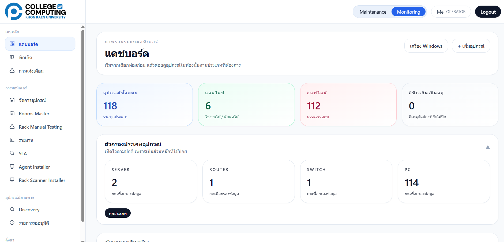
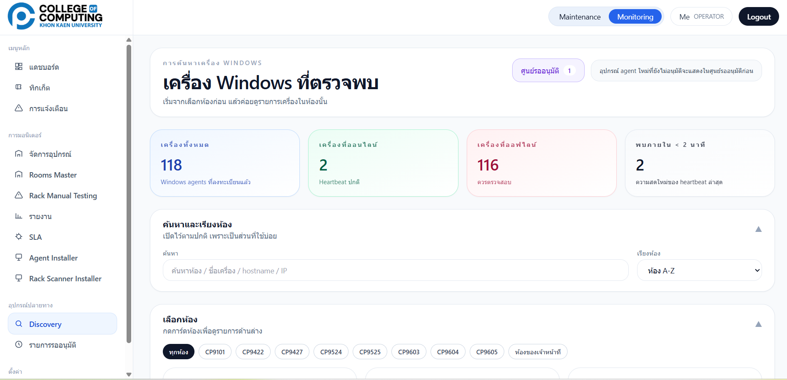
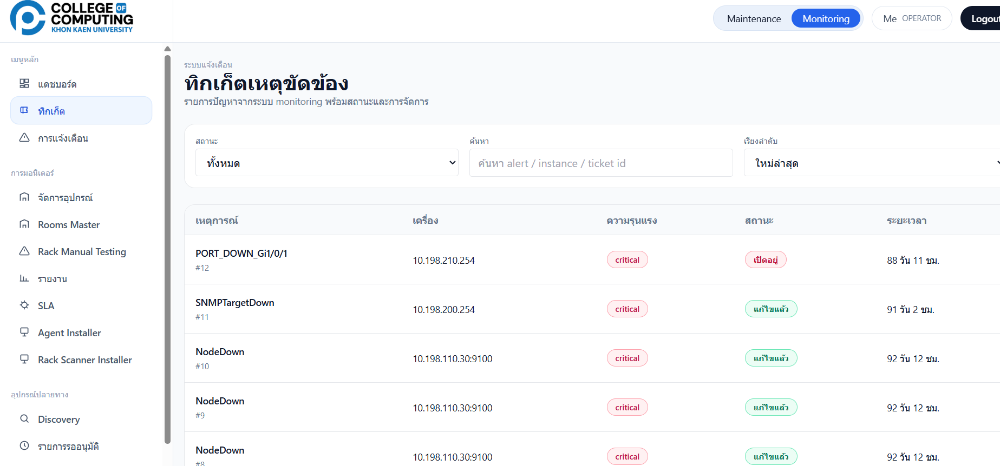

# Preventive Maintenance & Network Monitoring Platform

A web-based application for preventive maintenance, asset management, infrastructure monitoring, and incident management.

## Technologies

* Next.js
* FastAPI
* Python
* SQLite
* Prometheus
* Grafana
* Alertmanager
* SNMP
* Ubuntu Server
* VMware

## Features

* Asset Inventory Management
* Preventive Maintenance Workflow
* Device Lifecycle Tracking
* Real-Time Monitoring
* Alert Management
* Ticket Management
* Dashboard & Reporting

## Architecture

Frontend: Next.js

Backend: FastAPI

Monitoring: Prometheus + Grafana + Alertmanager

Infrastructure: Ubuntu Server + VMware

## Author

Thanakrit Hongto

## Screenshots

### Dashboard

### Inventory Management

### Ticket Management

